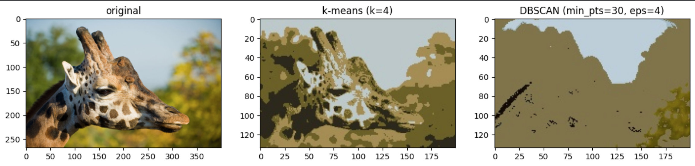

# K_mean and DB_scan

## Image Segmentation
Image segmentation is the process of taking a digital image and dividing it into subgroups called segments, thereby reducing the overall complexity of the image and enabling the analysis and processing of each segment. If we delve into image segmentation further, we see that a segmentation image is all about assigning particular labels to pixels to identify objects, people, and other important elements. More details [Here](https://mindy-support.com/news-post/what-is-image-segmentation-the-basics-and-key-techniques).

#### The following program performs image segmentation using [Kmeans](https://databasecamp.de/en/ml/k-means-clustering) clustering and [DBSCAN](https://www.mygreatlearning.com/blog/dbscan-algorithm/).

### Here the following steps for the procedure of Kmean and DBScan.

1. First we have created setup the environment using PYCharm as IDE for the given template by professor.

2. After that I install the dependencies for running the project. Download the above scripts (numpy, matplotlib, opencv-python)

```
> pip install numpy
> pip install matplotlib
> pip install opencv-python
```
3. After installing the dependencies. We setup the required variables for the Kmean and DBScan as per requirement in the file "clustering_task.ipynb" in Kmean and DBScan section.

4. Set the image path in the following file "clustering_task.ipynb", which image is going to use.

5. Now after setting up the whole environment and writing the algorithm for the transformation. Its time to start the project using the following command on the terminal.
```
> python clustering_algorithms.py
```
6. After that run each section from the file "clustering_task.ipynb" using Jupyter notebook, also setting up the server.
7. After running all the scripts from there. You can see 3 images, which is transformed and created after performing the Kmean and DBScan.
8. Here you can see the following images.



9. Output

Image will be stored in kmeans_output.jpg or dbscan_output.jpg

Use -r flag to resize image. Recommended for DBSCAN algorithm for fast processing.

----------------------
## Authors
Anees ur Rehman (Matriculation: 5002725)

